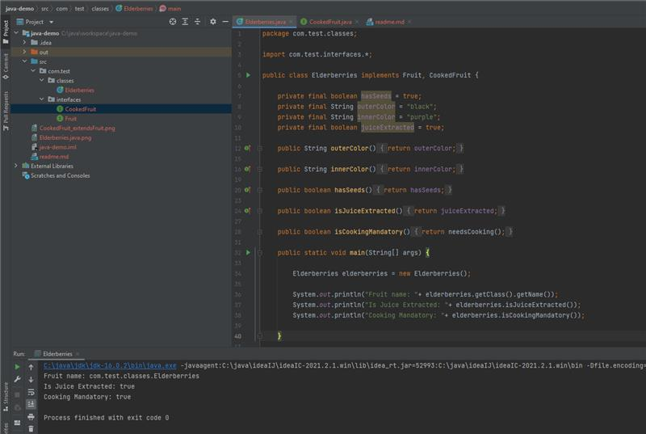

# _Default Methods_ in _Interfaces_ and _Polymorphism_

We all know that _Interfaces_ in java are representation of _Abstraction_ of **behaviours**.
From Java 8 onwards with the introduction of _Default Method_ semantics in a Java _Interface_ they can associate some
generally applied logic along with abstraction context.

This makes creating java utility classes redundant and in some scenarios some general use utility methods and logics can
be harboured along with the Interface which is inherited by a Class. This give additional purpose to interfaces with
such introduction with new Java update.

However, New changes do come with some thoughtful questions like the one which i faced recently in a discussion with a
senior development manager. As an introspection, in my usual self, i never give a guess based answer to someone seeking
my inputs. Hence, I apologised them to record my response to their question which is as follows:

Q. Do Interfaces in Java play some role in defining Polymorphic properties of OOPs?

- I know that use of Generics, Method Overloading and Overriding are responsible for polymorphic behaviors. Interfaces
  in their original intent are responsible for declaration of expected behaviors only. Hence, the answer inclined to No.
- The counter question involving Default Method was about to hit me...

Q. Java 8 onwards we have default methods defined in Interfaces. Lets say we have defined 2 interfaces and each with
having default method with same method signature. And, we inherit these Interfaces to Implement behaviors to a Class.
Now,

1. Is doing above possible?
2. If Yes, Which Interface's default method will be invoked in Class when needed.

And hence, Obviously upon understanding the conflict on my previous statement. I had to steer away from stating any
response.

So, Now in order to test the theory to test for better understanding; I created 2 interfaces

1. _Fruit.java_
2. _CookedFruit.java_

These interfaces supply Abstract behavior to our concrete implementor _Elderberries.java_

The **ANSWER** was spot on-

**Compile error** in Elderberries.java which says-

_com.test.classes.Elderberries_ **inherits unrelated defaults** for _needsCooking()_ from _types
com.test.interfaces.Fruit_ and _com.test.interfaces.CookedFruit_

This called for another test-

Q. What if CookedFruit extends Fruit?

- The compile error was vanished .
- But then the question of second part is still valid, waiting to be discovered.

It was seen that _needsCooking()_ from _Fruit.java_ is overridden by _CookedFruit.java_

Demonstrated as-

:) .. Thanks Jeremy